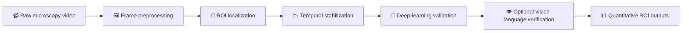

# 🫀 SmartGut

> **Automated gut contraction analysis for fruit fly microscopy videos**  
> SmartGut is a hybrid video-analysis pipeline for **detecting, tracking, and quantifying gut contraction regions of interest (ROIs)** from time-series microscopy data.

<p align="center">
  
</p>

<p align="center">
  <a href="https://github.com/wenxiwang2000/smart-gut"></a>
  
  
  
</p>

---

## 🔒 Research Notice

> Some core mathematical components of the algorithm are currently withheld and will be released after the associated research publication.

---

## ✨ Overview

Gut contraction analysis from microscopy videos is difficult because of:

- motion drift
- unstable contrast
- noisy backgrounds
- ROI ambiguity across frames

SmartGut addresses these challenges through a **multi-stage detection and validation workflow** that combines:

| Module | Role |
|---|---|
| 🧩 **Multi-template matching (NCC)** | Localizes candidate gut ROIs |
| 🪄 **Canny edge filtering** | Enhances structural boundaries |
| 📉 **Kalman filtering** | Stabilizes ROI trajectories across frames |
| 🧠 **EfficientNet-B7 classification** | Filters artifacts and validates true ROIs |
| 👁️ **Optional vision–language verification** | Adds an additional confidence layer |

The result is a pipeline that transforms raw microscopy videos into **trackable ROI signals** and **quantitative contraction metrics**.

---

## 🧠 Core Idea

SmartGut uses a **hybrid analysis strategy** rather than relying on only one method.

### Workflow logic

1. **Template-based localization**  
   Candidate gut regions are detected using normalized cross-correlation (NCC).

2. **Image preprocessing**  
   Contrast and edges are enhanced to improve structural visibility.

3. **Temporal smoothing**  
   Kalman filtering is used to reduce frame-to-frame jitter and stabilize ROI paths.

4. **Deep-learning validation**  
   EfficientNet-B7 classifies candidate ROIs as valid or artifact.

5. **Optional multimodal verification**  
   A vision–language verification step can add a second validation signal.

This combination helps SmartGut achieve **stable**, **reproducible**, and **robust** ROI tracking across long microscopy videos.

---

## 🔬 Workflow

### Figure 1. SmartGut analysis workflow


**High-resolution version:**  
https://github.com/user-attachments/files/25622638/SmartGut_page2.tiff

### Pipeline summary



---

## ⚙️ Core Pipeline

### 1. 🖼️ Frame preprocessing

Each frame undergoes several normalization steps:

- grayscale conversion
- **CLAHE contrast normalization**
- Gaussian denoising

These operations improve signal clarity before detection.

---

### 2. 🎯 ROI localization

Candidate ROIs are detected using:

- **multi-template matching (NCC)**
- optional **Canny edge enhancement**

This stage identifies user-defined gut regions even under variable imaging conditions.

---

### 3. 📉 Temporal stabilization

To reduce jitter and maintain smooth ROI trajectories:

- **Kalman filtering** is applied across frames.

---

### 4. 🧠 Deep-learning classification

Detected ROIs are validated using a fine-tuned **EfficientNet-B7** model.

**Training setup:**

- Adam optimizer
- cross-entropy loss
- standard augmentation strategies

This stage removes false-positive detections and improves confidence in tracked ROIs.

---

### 5. 👁️ Optional verification

For higher confidence, SmartGut can apply an additional:

- **vision–language verification step**

This acts as an independent validation layer for more difficult imaging conditions.

---

## 📊 Example Detection Results

### Detection and tracking examples

| 🔬 Microscopy detecting | 🧪 Raw microscopy frame |
|:--:|:--:|
|  |  |

| 🪄 Canny & Kalman filtering | ⏱️ Temporal tracking |
|:--:|:--:|
|  |  |

These examples illustrate SmartGut’s ability to:

- detect candidate gut ROIs
- classify likely true contraction regions
- stabilize trajectories across time
- preserve quantitative tracking information frame by frame

---

## 📈 Performance

Benchmarking showed clear gains in detection reliability:

| Metric | Before | After | Improvement |
|---|---:|---:|---:|
| 🎯 Template-based detection accuracy | 50% | 75% | +25 percentage points |
| ✅ Vision–language confidence | 93% | 97% | +4 percentage points |

These results support the benefit of combining **classical computer vision** with **deep-learning validation**.

---

## 📦 Output

After analysis, SmartGut generates:

| Output | Description |
|---|---|
| 🎞️ `annotated.mp4` | Video with bounding-box ROI tracking |
| 📋 ROI coordinate tables | Exported ROI positions across frames |
| 📈 Matching confidence scores | Detection/validation confidence values |
| 📊 Quantitative contraction metrics | Downstream contraction analysis outputs |

These outputs support both:

- **visual inspection**
- **downstream quantitative analysis**

---

## ⚙️ How to Use

### 1. Prepare ROI templates

Manually crop representative ROI templates in **PNG format**.

### 2. Organize template files

Place the templates in the designated template directory.

### 3. Run the pipeline

```bash
python combine_and_match.py test.mp4
```

---

## 🧭 Project Summary

| Category | Summary |
|---|---|
| 🧪 Input | Fruit fly microscopy videos |
| 🎯 Main task | Detect, track, and quantify gut contraction ROIs |
| 🛠️ Core methods | NCC, Canny filtering, Kalman filtering, EfficientNet-B7 |
| ➕ Optional module | Vision–language verification |
| 📤 Main outputs | Annotated video, ROI tables, confidence scores, contraction metrics |

---

## 🌟 Why SmartGut

SmartGut is designed for microscopy workflows where ROI tracking is otherwise difficult to perform reproducibly by hand.

### Key strengths

- ✅ hybrid CV + DL design
- ✅ reproducible ROI validation
- ✅ temporal smoothing for stable tracking
- ✅ quantitative outputs for downstream analysis
- ✅ optional multimodal verification for difficult cases

---

## 🔗 Links

- **GitHub repository:** https://github.com/wenxiwang2000/smart-gut
- **High-resolution workflow figure:** https://github.com/user-attachments/files/25622638/SmartGut_page2.tiff

---

## 📄 Suggested Citation / Description

**SmartGut** is an automated video-analysis pipeline for detecting, tracking, and quantifying gut contraction ROIs in fruit fly microscopy videos, combining classical computer vision with lightweight deep-learning validation for robust and reproducible contraction analysis.
